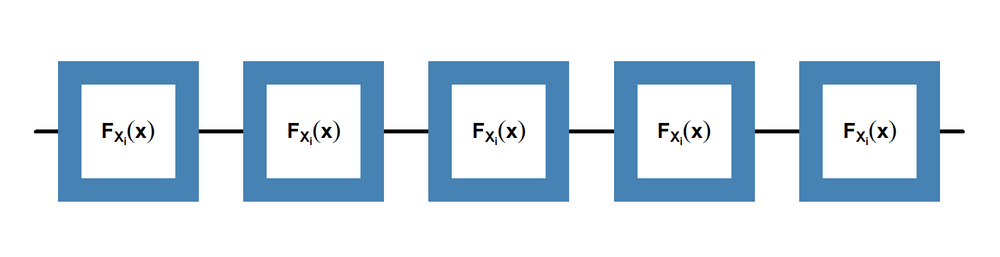

# Overview

```{r setup, echo=FALSE}
knitr::opts_chunk$set(echo = FALSE, fig.align = 'center')
shiny::includeCSS("../resources/css/flatly-style.css")
shiny::includeCSS("../resources/css/r-title.css")
shiny::includeScript("../resources/js/jquery.min.js")
shiny::includeScript("../resources/js/jkf-scroll.js")

library(knitr)
library(reticulate)
library(rprojroot)
knitr::knit_engines$set(python = reticulate::eng_python)
knitr::opts_chunk$set(echo = TRUE, message = F, comment = NA, warning = F)
root = find_root(is_git_root)
```

## Introduction to Statistical Inference

- "Statistical inference" describes a decision making process wherein statistics and probability theory are used to draw conclusions about some unknown aspect of a population

    + Is a core concept for experimental research 
    + Has broad applicability across many domains
    + Can sometimes be difficult for students to understand

- Decision are made on the basis of a random sample of observations that were drawn from the population

- Statistical inference can be sub-divided into two main areas: Estimation and Hypothesis testing

## Estimation

- In estimation, a random sample is used to describe some unknown aspect of the population from which the sample was taken

    + <span class="explain">Measures of central tendency</span> <span class="tooltip">- mean<br>- median<br>- mode<br></span>
    + <span class="explain">Measures of spread/variability</span> <span class="tooltip">- variance<br>- standard deviation</span>
    + <span class="explain">Parameter values</span> <span class="tooltip">- shape parameter<br>- scale parameter<br>- rate parameter</span>

- These descriptions come in one of two types - depending on the goal of the analysis

    + Point estimates
    + Interval estimates

## Hypothesis Testing

- In hypothesis testing, a random sample is used to decide which of two complementary statements about a population are true

    + A hypothesis is a tentative explanation for something
    + Hypothesis testing begins by drawing a random sample and computing on or more characteristics (statistics)
    + Hypothesis testing is an inferential process, based on probability, and is used to draw conclusions about the population parameters

# Motivating Example

## Building Widgets

- Suppose that we manage a factory that produces "widgets"

```{r, echo=FALSE, eval=FALSE}
par(mar = c(8,0,8,0), oma = c(0,0,0,0))
ylim = 0.25
plot(x = 0:10,
     y = rep(ylim/2,11),
     xlim = c(0,10), 
     ylim = c(0,ylim), 
     ann = F, 
     axes = F,
     type = "l",
     lwd = 3)

points(x = c(1,3,5,7,9),
       y = rep(ylim/2,5),
       pch = 15,
       cex = 15,
       col = "steelblue")

points(x = c(1,3,5,7,9),
       y = rep(ylim/2,5),
       pch = 15,
       cex = 10,
       col = 0)

text(x = c(1,3,5,7,9),
     y = rep(ylim/2,5),
     expression(bold(F[X[i]](x)))
     )
```

```{r, out.width="100%", fig.cap="A random sample of five of our 'not-too-exciting' widgets",echo=FALSE}

```

- Each widget we produce comes with a lot of measureable properties

    + Physical properties: Strength, hardness, fracture toughness
    + Electrical properties: Conductivity

- For each widget, the values associated with each of these properties is based on the materials and processes used to manufacture and assemble the widgets

    + <span class="explain">Materials used</span> <span class="tooltip">- plastic<br>- aluminum<br>- steel<br>- titanium</span>
    + <span class="explain">Methods used to form materials</span> <span class="tooltip">- injection molding<br>- casting<br>- forging<br>- machining</span>
    + <span class="explain">Methods used to connect sub-components</span> <span class="tooltip">- bonding<br>- welding<br> - fastened<br>- electrical connections</span>

- Moreover, the values measured for each widget will not be the same, but will be uncertain - varying from widget to widget

- This uncertainty will be derived from several sources

    + Impurities in the raw materials used to manufacture the widgets
    + Deviations in the processes used to form the material
    + Imprefections in connecting the sub-components
    + Manufacturing facilities out of calibration

## Assessing Uncertainty

- It's important that we can <span class="explain">make certain assurances</span> <span class="tooltip">- "Our widgets will operate without fault or failure for a specified time period"<br>- "Our widgets will meet strict dimensional requirements for height, width, weight, etc."</span> to our customers that the widgets they purchase will meet their requirements.

- To make these assurances we need to collect data on our widgets

- The data will be collected by conducting different types of tests

    + Destructive drop tests to ensure that a typical widget could survive a fall from a designated height
    + Manufacturing verification tests to ensure that the widgets being produced have the correct dimensions

- Each test we perform on a widget generates one or more observational measures (observations)

    + Dimensional measures: "The length of widget-102 is 14.2 inches"
    + Operational measures: "Widget-54 survived the 48-inch drop test"

- Each observation contains information about the properties of the widget being tested

- The information obtained from testing each widget gives us a small glimpse of the properties of the overall population of widgets

- Pooling the information obtained from all of the widgets together provides a more complete view of the population's properties 

## Making inferences

- We presume that there exists an underlying mathematical model $F_{\text{perfect}}$ that perfectly describes the properties of the widgets in the population

- This perfect model would also explain the variability that exists in our observed data due the various sources of uncertainty

    + Uncertainty due to imperfctions in the manufacturing processes
    + Uncertainty due to imperfections in our testing procedures
    + Uncertainty due to imperfections in our measurement capabilities
    
- We'll never know the true form of $F_{\text{perfect}}$ as there are also sources of uncertainty we don't know about and cannot account for 
    
- Therefore, our goal is to create an mathematical model $F_{\text{imperfect}}$ that imperfectly represents $F_{\text{perfect}}$

    + $F_{\text{imperfect}}$ will be based on the data we observe and our prior knowledge of the widgets being produced
    + The more information we have the more accurately $F_{\text{imperfect}}$ will represent $F_{\text{perfect}}$
    + More information requires testing more widgets
    + More testing means more time and money spent on testing - and more widgets being tested that cannot be sold to customers

- Questions to consider in collecting data

    + Clearly aren't going to test every widget that is produced - but, how many should be tested?
    + Out of the population of widgets, how should we choose which widgets to test?

- We want to sample from our population of widgets <u>randomly</u> 

    + Capture fluctuations that may occuer in our manufacturing process over time
    + Capture fluctuations in materials used (i.e. changing suppliers)

```{r child="random_sample.Rmd", eval=TRUE}
```

```{r child="estimation.Rmd", eval=TRUE}
```

```{r child="hypothesis.Rmd", eval=TRUE}
```

# Summary

## In this presentation

- Discussed that inference is a decision making process

    + Uses statistics and probability theory
    + Used to describe a population based on a random sample of observations drawn from the population 

- We introduced the types of inference

    + Estimation
    + Hypothesis testing

## In the next presentation

- Walkthrough examples of carrying out various type of inferences

    + Maximum likelihood estimation of population parameters
    + Create hypothesis statements
    + Use Python to conduct $t$, $F$, $\chi^2$ hypothesis tests