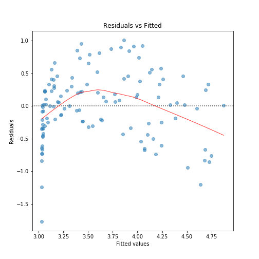
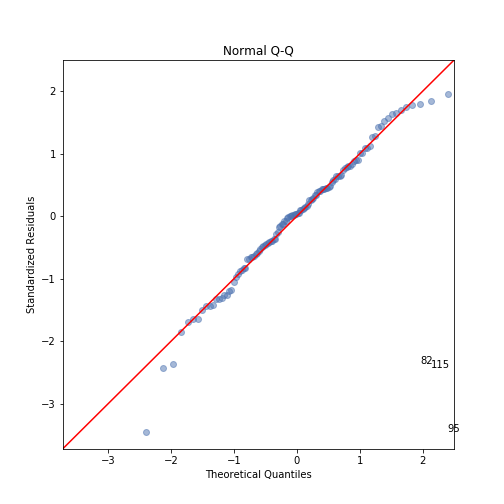

# Linear Regression

## Overview

- Simple approach for supervised learning

- A useful tool for predicting a quantitative response

- Is a useful and widely used statistical learning method

- Serves as a good jumping-off point for newer approaches: 

    + Many statistical learning algorithms are generalizations or extensions of linear regression
    
    + Important to understand linear regression before studying more complex learning algorithms

- This lecture serves as an introduction to simple linear regression and will cover the following topics

    1. Libraries you'll need to reproduce this analysis
    2. Reviewing, accessing, and preparing the data for modeling
    3. Simple linear regression: Predicting a quantitative response $Y$ with a single predictor variable $X$
    
- In a subsequent lecture we'll extend this to discuss the following

    4. Multiple linear regression: Predicting a quantitative response $Y$ with multiple predictor variables $X_1, X_2, \dots, X_p$
    5. Incorporating interactions between the variables
    6. A few other considerations to know about

# Replication Requirements

## Importing libraries

- First, let's be sure to import the Python libraries we'll need to complete this analysis

```{python import}
import random
import numpy as np
import pandas as pd
import seaborn as sb
import matplotlib.pyplot as plt
import scipy as sp
import statsmodels.api as sm
import statistics as st
```

## understanding the data

- This lecture uses the [advertising](http://www-bcf.usc.edu/~gareth/ISL/Advertising.csv) data set made available by the authors of the text [An Introduction to Statistical Learning](http://www-bcf.usc.edu/~gareth/ISL/index.html)

- The data set contains four columns of advertising-related features captured across 200 markets

    + `TV`: Money spent on television advertising (in thousands of dollars)
    + `radio`: Money spent on radio (in thousands of dollars)
    + `newspaper`: Money spent on newspaper advertising (in thousands of dollars)
    + `Sales`: return on the advertising investment (in dollars) 

- The question to be addressed by analyzing this data set

    + Is there are relationship between `Sales` and the way that advertising dollars are spent
    + To what degree does money spent on `TV` advertising impact `Sales`
    + To what degree does money spent on `radio` advertising impact `Sales`
    + To what degree does money spent on `newspaper` advertising impact `Sales`
    + What type of advertising provides the greatest impact on `Sales`
    
## Accessing the data

- To access the data, we'll extract it from the CSV file and store it as a `pandas` DataFrame using `read_csv()`

    + Assign the URL to a text string
    + Assing the extracted data to a DataFrame called `df`

```{python read_data}
data_url = "http://faculty.marshall.usc.edu/gareth-james/ISL/Advertising.csv"

df = pd.read_csv(data_url)
```

- Note that extracting the data in this manner results in an un-needed column containing the row numbers

```{python advertising_head1}
df.head()
```

- Instead, use the `usecols` argument to select which columns we want to extract

- Note that we supply these column names as a list using `{ }`

```{python read_data2}
df2 = pd.read_csv(data_url,
                  usecols = {'TV','newspaper','radio','sales'})

df2.head()
```

# Preparing Our Data

## Partitioning the data 

- Initial discovery of relationships is usually done with a training set while a test set is used for evaluating whether the discovered relationships hold

    + A training set is used to discover potentially predictive relationships 
    + A test set is used to assess the strength and utility of a predictive relationship.  

- We'll use a 60% / 40% split to partition the data set

    + We train our model on 60% of the data 
    + Then test the model performance on the 40% of the data that was withheld

```{python train_test}
rows = range(df2.shape[0])

train_rows = random.sample(rows, 
                           int(0.6 * len(rows)))

test_rows = list(set(rows) - set(train_rows))

train_data, test_data = df2.iloc[train_rows], df2.iloc[test_rows]

train_data.shape
test_data.shape
```

# Simple Linear Regression - 1

## Overview

- Simple linear regression is a straightforward approach for predicting a quantitative response $Y$ on the basis of a single predictor variable $X$. 

- Assumes there is an approximately a linear relationship between $X$ and $Y$

- Using the `advertising` data, suppose we wish to model the relationship between the `TV` budget and `sales`

# Simple linear regression - 2

## Building the model

- To build a simple regression model in Python we use the `OLS()` (ordinary least squares) function from the `api` module in the `statsmodels` library

- In matrix notation, a linear regression model is expressed as

$$
\begin{aligned}
\boldsymbol{y} &= \beta_0 + \beta_{1}\boldsymbol{X} + \epsilon\\\\
\begin{bmatrix}
y_{1} \\
y_{2} \\
\vdots  \\
y_{m} 
\end{bmatrix} &=
\begin{bmatrix}
1& X_{1}\\
1& X_{2}\\
\vdots & \vdots \\
1& X_{m} 
\end{bmatrix}
\begin{bmatrix}
\beta_{0} \\
\beta_{1}
\end{bmatrix}+
\begin{bmatrix}
\epsilon_{1} \\
\epsilon_{2} \\
\vdots  \\
\epsilon_{m} 
\end{bmatrix}
\end{aligned}
$$

- where: 

    + $y$ is a vector of responses
    + $X$ is a matrix of input values
    + $\beta_0$ is an intercept parameter
    + $\beta_1$ is the effect parameter for $X_1$
    + $\epsilon$ is a mean-zero random error term

- To build this model, we first need to define the $X$-matrix of inputs and the $y$ vector of responses from the training data - this is done below  

```{python X_y}
X = train_data[{"TV"}]
y = train_data["sales"]
```

- Then, we need to add the column of ones to the $X$-matrix to account for the intercept term

```{python add_constant}
X = sm.add_constant(X)
```

- With $X$ and $y$ defined we build the model and fit it to the data

```{python OLS}
model = sm.OLS(y, X)

model_fit = model.fit()
```

# Simple linear regression - 3

## Checking the assumptions

- Building a linear regression model is only half of the work

- To use the model you must should check that it conforms to the assumptions of linear regression

## Assuption #1: The model is linear in parameters

- This just means that no functions are being applied to the $\beta$ parameters

    + Examples: $\beta_1^2$, $\exp[\beta_1]$
    + Applying functions to the inputs is fine $X^2$, $\exp[X]$

- By simply viewing our model we see that this assumption is met

## Assumption #2: The mean of the residuals is zero

- The result of a simple linear regression model is a line of best fit

- The data points usually don’t fall exactly on this regression equation line

- A residual is the vertical distance between a data point and the regression line

- For each data point we get one residual

    + If the point falls above the regression line the resdiual is positive 
    + If the point falls below the regression line the residual is negative
    + If the regression line passes through the point, the residual for that observation is zero

- We want to see that the residuals are approximately equally distributed about zero

- We can check to see if the mean of the residuals is in fact zero by extracting the residuals from the model and then taking the mean of these values

- This is done in the code chunk below - we see that the result is a value that, numerically speaking, is zero 

```{python mean_residuals}
## model residuals
model_residuals = model_fit.resid

st.mean(model_residuals)
```

- We can also check this graphically, by creating a residual plot

```{python residplot, eval=F}
plot = sb.residplot(model_fit.fittedvalues, 
                    train_data.columns[3], 
                    data=train_data,
                    lowess=True,
                    scatter_kws={'alpha': 0.5},
                    line_kws={'color': 'red', 'lw': 1, 'alpha': 0.8})

plot.set_title('Residuals vs Fitted')
plot.set_xlabel('Fitted values')
plot.set_ylabel('Residuals');

plt.show(plot)
```

```{r, fig.align='center', out.width="30%", echo=FALSE}

```

## Assumption #3: Constant variance among the residuals

- This is typically verified through graphical means by inspecting the residual plot

- We want to see that there's no shape in residuals moving from right to left - essentially a rectangular cloud of points

- Observing the residual plot for this data set we see that there is a distinct funnel shape where the variance increases as we move from left to right - this is not good

- Often we implement a transformation on either the predictor (input) variable or the response (output) variable (or both) to ensure that this assumption is met

- In the code chunk below you can explore different type of transformations on both of these variable to see how this impacts the shape of the residual plot  

```{python, eval=FALSE}
df2 = pd.read_csv(data_url,
                  usecols = {'TV','newspaper','radio','sales'})

##apply a transformation on the TV column
df2["TV"] = (df2["TV"])**2

# apply a transformation on the sales column
df2["sales"] = np.sqrt(df2["sales"])

train_data, test_data = df2.iloc[train_rows], df2.iloc[test_rows]

X = train_data[{"TV"}]
y = train_data["sales"]

X = sm.add_constant(X)

model = sm.OLS(y, X)

model_fit = model.fit()

## model residuals
model_residuals = model_fit.resid

st.mean(model_residuals)

plot_lm = plt.figure()
plot_lm.axes[0] = sb.residplot(model_fit.fittedvalues, 
                               train_data.columns[3],
                               data=train_data,
                               lowess=True,
                               scatter_kws={'alpha': 0.5},
                               line_kws={'color': 'red', 'lw': 1, 'alpha': 0.8})

plot_lm.axes[0].set_title('Residuals vs Fitted')
plot_lm.axes[0].set_xlabel('Fitted values')
plot_lm.axes[0].set_ylabel('Residuals');

plt.show()
```

## Assumption #3 - the residuals are normally distributed

- This is another assumption that is often checked via graphical methods

- We are looking to verify that the residuals are normally distributed by plotting them on what is know as a quantile-quantile plot (or QQ plot)

```{python qqplot, eval=F}
from statsmodels.graphics.gofplots import ProbPlot

model_norm_residuals = model_fit.get_influence().resid_studentized_internal

QQ = ProbPlot(model_norm_residuals)

plot_lm_2 = QQ.qqplot(line='45', alpha=0.5, color='#4C72B0', lw=1)

plot_lm_2.axes[0].set_title('Normal Q-Q')
plot_lm_2.axes[0].set_xlabel('Theoretical Quantiles')
plot_lm_2.axes[0].set_ylabel('Standardized Residuals');

# annotations
abs_norm_resid = np.flip(np.argsort(np.abs(model_norm_residuals)), 0)
abs_norm_resid_top_3 = abs_norm_resid[:3]

for r, i in enumerate(abs_norm_resid_top_3):
    plot_lm_2.axes[0].annotate(i,
                               xy=(np.flip(QQ.theoretical_quantiles, 0)[r],
                                   model_norm_residuals[i]));
plt.show()
```

```{r, fig.align='center', echo=FALSE, out.width="30%"}

```

## Understand the results of a regression model output

- The code in the chunk below is used to generate a summary of the model we built earlier

- Below we describe what several of these values mean

```{python}
print(model_fit.summary())
```

```{python, echo=FALSE}
prm_0 = model_fit.params[0]
prm_1 = model_fit.params[1]
```

- So, we have \[\text{sales} = `r round(py$prm_0, 4)` + `r round(py$prm_1, 4)`X + \epsilon\]

## Using the model to predict results for new inputs

```{python}
X_new = test_data["TV"]
X_new = sm.add_constant(X_new)

# make the predictions by the model
test_data["predictions"] = model_fit.predict(X_new) 

test_data
```

